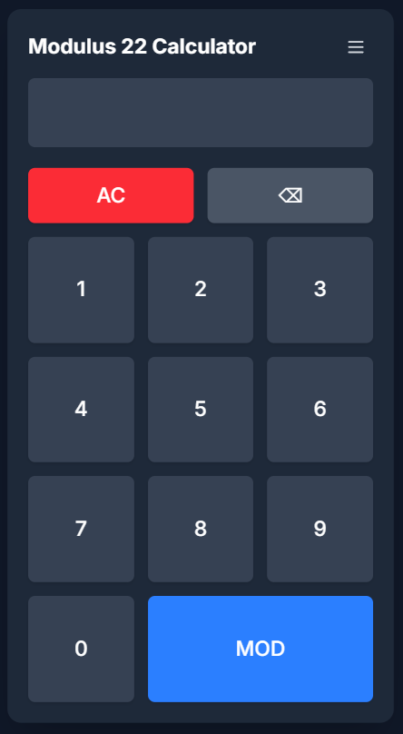
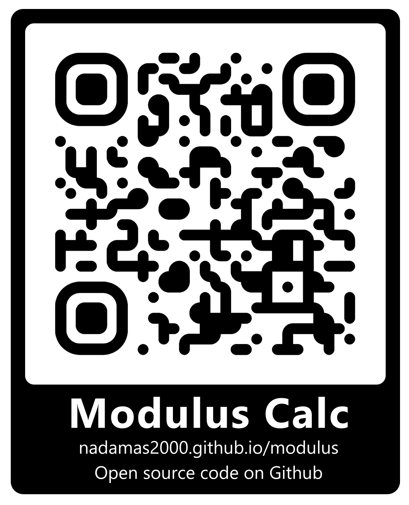

# 🧮 Modulus Calculator

A simple and elegant web application to calculate the modulus (remainder of a division) of a number. Built with a modern and responsive design, it's perfect for use on both desktop and mobile devices.

**Built specifically for the "Modulus of Love" card game.**



-----

## ✨ Features

  * **Modulo Calculation:** Quickly and easily performs the `number % modulus` operation.
  * **Configurable Modulus:**
      * Set a default modulus on page load via a URL parameter.
      * Change the modulus at any time through the in-app settings menu.
  * **Large Number Support:** Thanks to JavaScript's `BigInt`, the calculator can handle integers of any size without losing precision.
  * **Responsive & Modern Design:** A clean interface built with **Tailwind CSS** that adapts to any screen size and supports your system's dark mode.
  * **Keyboard Shortcuts:** Use the calculator efficiently with your physical keyboard.
  * **Intuitive Interface:** Buttons with visual feedback and a user experience optimized for touch devices.

-----

## 🚀 How to Use

You can access the application by clicking the link or scanning the QR code below:

| Direct Link | Scan with your mobile |
| :--- | :--- |
| **[https://nadamas2000.github.io/modulus/](https://nadamas2000.github.io/modulus/)** <br><br> *Click here to open the web app.* |  |

### 1\. Setting the Modulus

You have two ways to define the number you want to divide by (the modulus):

  * **Via the URL (on load):**
    Add the `?num=` parameter to the URL to set a specific modulus. By default, it is `22`.

    *Example for using modulus 33:*

    ```
    https://nadamas2000.github.io/modulus/?num=33
    ```

  * **Via the Interface (at any time):**

    1.  Click the **menu button** (☰) in the top-right corner.
    2.  Enter the new number in the "Modulus" input field.
    3.  Press the **"Set"** button. The title will update to reflect the new modulus.

### 2\. Performing a Calculation

1.  Enter the number you want to find the remainder for using the buttons or your keyboard.
2.  Press the **"MOD"** button.
3.  The result will appear on the display.

-----

## ⌨️ Keyboard Shortcuts

| Key | Action |
| :--- | :--- |
| `0` - `9` | Enter numbers |
| `Enter` or `=` | Calculate the modulus (MOD) |
| `Backspace` | Delete the last digit (`⌫`) |
| `Escape` or `C` | Clear the entire display (`AC`) |

-----

## 🛠️ Tech Stack

  * **HTML5**
  * **Tailwind CSS** for rapid and modern UI design.
  * **Vanilla JavaScript** for all the application logic.
  * **Google Fonts** for the typography (`Inter`).

-----

## 👨‍💻 Development & Setup

This project uses a local Tailwind CSS build process to optimize performance. To set up the project for development:

1.  **Prerequisites**: Make sure you have [Node.js](https://nodejs.org/) and npm installed.

2.  **Install Dependencies**: Clone the repository and install the required packages.

    ```bash
    npm install
    ```

3.  **Run the Development Server**: This command will watch for changes in your CSS files and automatically rebuild the output file.

    ```bash
    npm run dev
    ```

4.  **Build for Production**: To generate the minified production-ready CSS file, run:

    ```bash
    npm run build
    ```