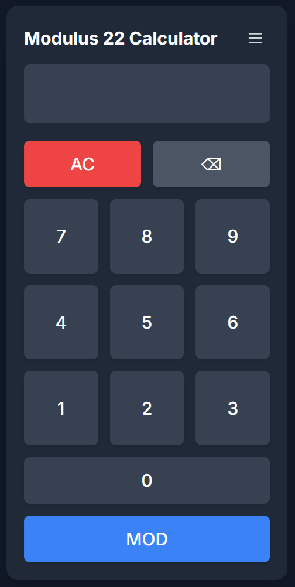

# 🧮 Modulus Calculator

A simple and elegant web application to calculate the modulus (remainder of a division) of a number. Built with a modern and responsive design, it's perfect for use on both desktop and mobile devices.

**Built specifically for the "Modulus of Love" card game.**



-----

## ✨ Features

  * **Modulo Calculation:** Quickly and easily performs the `number % modulus` operation.
  * **Configurable Modulus:**
      * Set a default modulus on page load via a URL parameter.
      * Change the modulus at any time through the in-app settings menu.
  * **Input Validation:**
     * The modulus is restricted to whole numbers between **2** and **1,000,000** to ensure stable calculations.
     * The on-screen number input is limited to **14 digits**.
  * **Precision with BigInt:** Uses JavaScript's `BigInt` to perform calculations, preventing floating-point errors and ensuring precision.
  * **UI Scaling:** Adjust the size of the calculator for better visibility.
  * **Responsive & Modern Design:** A clean interface built with **Tailwind CSS** that adapts to any screen size and supports your system's dark mode.
  * **Keyboard Shortcuts:** Use the calculator efficiently with your physical keyboard.
  * **Intuitive Interface:** Buttons with visual feedback and a user experience optimized for touch devices.

-----

## 🚀 How to Use

You can access the application by clicking the link or scanning the QR code below:

| Direct Link | Scan with your mobile |
| :--- | :--- |
| **[https://nadamas2000.github.io/modulus/](https://nadamas2000.github.io/modulus/)** <br><br> *Click here to open the web app.* |  |

### 1\. Configuration

You can configure the calculator in two ways:

  * **Via the URL (on load):**
    Add the `?num=` parameter to the URL to set a specific modulus. By default, it is `22`.

    *Example for using modulus 33:*

    ```
    https://nadamas2000.github.io/modulus/?num=33
    ```

  * **Via the Interface (at any time):**

    1.  Click the **menu button** (☰) in the top-right corner.
    2.  In the menu, you can:
          * **Set Modulus:** Enter the new number (from 2 to 1,000,000) in the "Modulus" input and press **"Set"**. The title will update.
          * **Set Scale:** Adjust the value in the "Scale" input to change the size of the calculator and press **"Set"**.

### 2\. Performing a Calculation

1.  Enter the number you want to find the remainder for using the buttons or your keyboard.
2.  Press the **"MOD"** button.
3.  The result will appear on the display.

-----

## ⌨️ Keyboard Shortcuts

| Key | Action |
| :--- | :--- |
| `0` - `9` | Enter numbers |
| `Enter` or `=` | Calculate the modulus (MOD) |
| `Backspace` | Delete the last digit (`⌫`) |
| `Escape` or `C` | Clear the entire display (`AC`) |

-----

## 🛠️ Tech Stack

  * **HTML5**
  * **Tailwind CSS** for rapid and modern UI design.
  * **Vanilla JavaScript** for all the application logic.
  * **Google Fonts** for the typography (`Inter`).

-----

## 👨‍💻 Development & Setup

This project uses a local Tailwind CSS build process to optimize performance. To set up the project for development:

1.  **Prerequisites**: Make sure you have [Node.js](https://nodejs.org/) and npm installed.

2.  **Install Dependencies**: Clone the repository and install the required packages.

    ```bash
    npm install
    ```

3.  **Run the Development Server**: This command will watch for changes in your CSS files and automatically rebuild the output file.

    ```bash
    npm run dev
    ```

4.  **Build for Production**: To generate the minified production-ready CSS file, run:

    ```bash
    npm run build
    ```